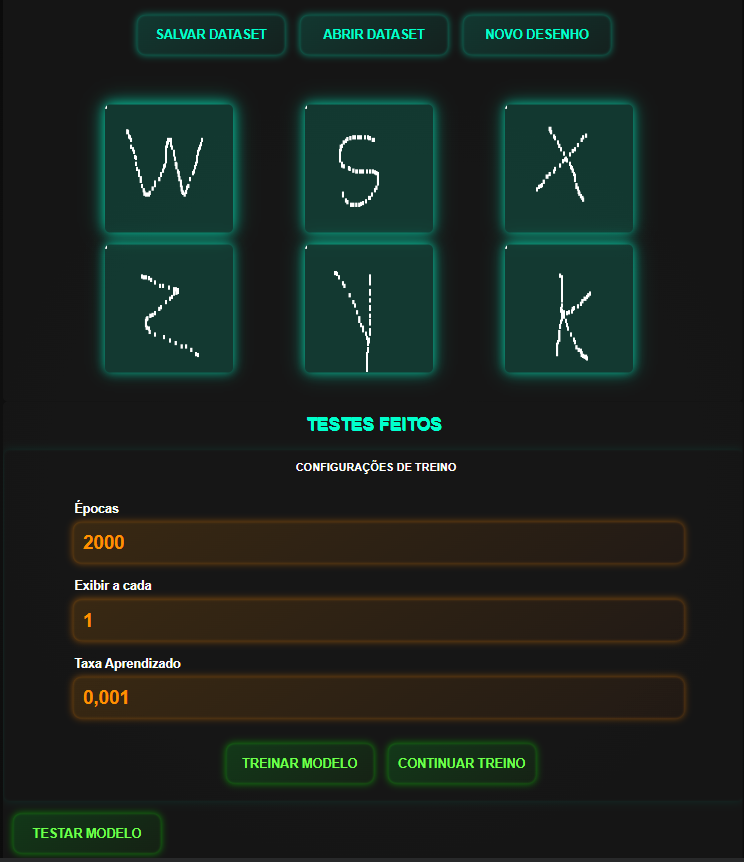

# classificadordigitos
The project is software for recognizing letters and numbers made with a neural network in JavaScript. With it, you can draw letters and numbers, creating a custom dataset to train the model. It is possible to save this data on the computer in JSON format and also import data to continue adding new drawings and continue training. After training, you can test the model by drawing new images and see how it matches what you drew.

[Ler em Portugues](./README.md)

# Imagens de exemplo
# Desktop

# Tablet

# Phone
