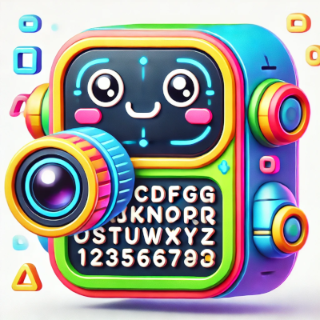
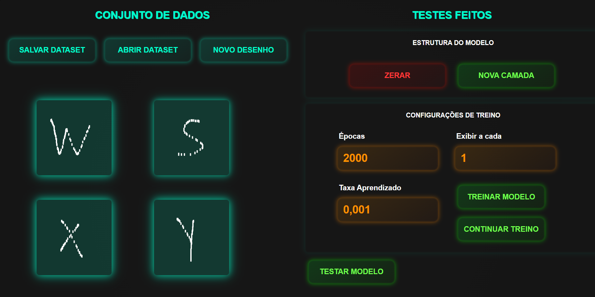
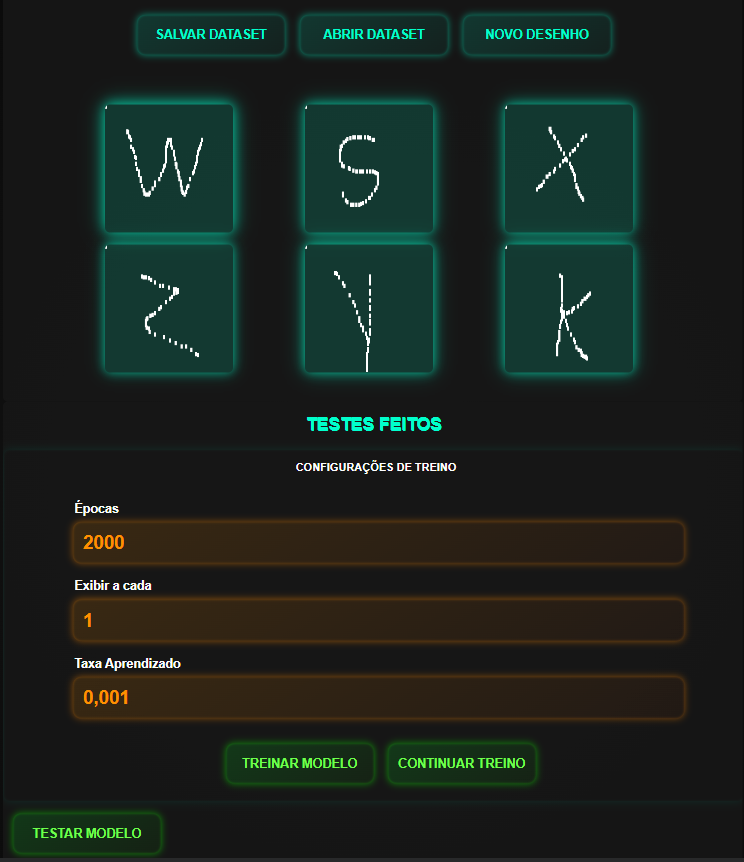
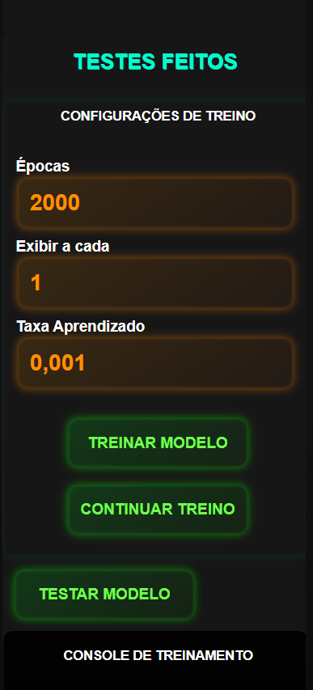

# clasificadordigitos
El proyecto es un software para el reconocimiento de letras y números realizado con una red neuronal en JavaScript. Con él, puedes dibujar letras y números, creando un conjunto de datos personalizado para entrenar el modelo. Es posible guardar estos datos en tu computadora en formato JSON y también importar datos para seguir añadiendo nuevos dibujos y continuar entrenando. Después del entrenamiento, puedes probar el modelo dibujando nuevas imágenes y ver cómo identifica lo que has dibujado.

# 🌐 Idiomas
[Leer en Inglés](./README-en.md)
[Leer en Portugues](./README.md)

# Detalles
Este proyecto fue creado para dar continuidad a otros dos proyectos míos:

- [WilliamJardim/MLP-Mini](https://github.com/WilliamJardim/MLP-mini)  
  La implementación de la Red Neuronal MLP.

- [WilliamJardim/DesenhadorDigitos](https://github.com/WilliamJardim/desenhadordigitos)  
  El editor de imágenes integrado.

# Imágenes de ejemplo
## Escritorio

## Tableta

## Teléfono

