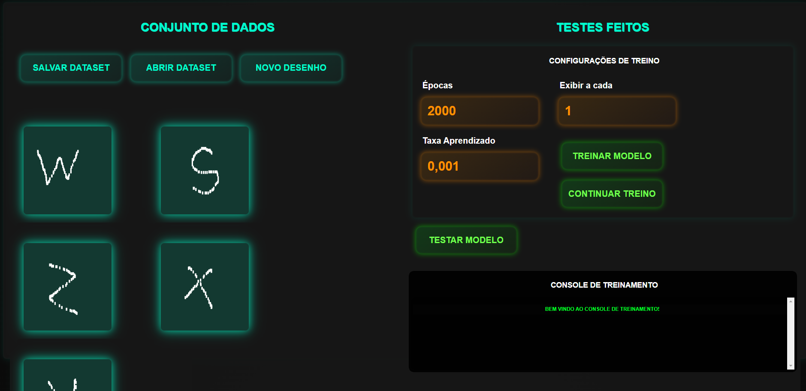
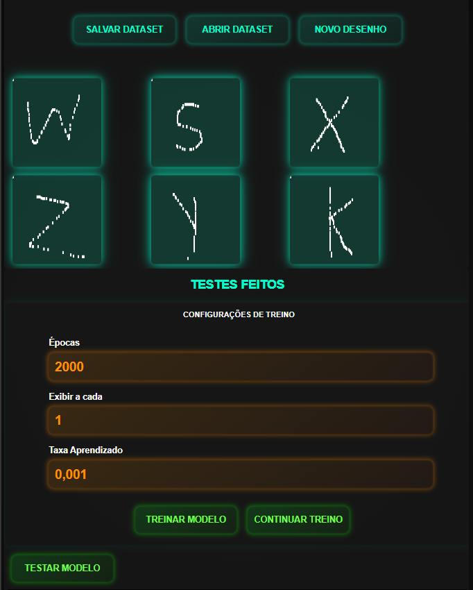
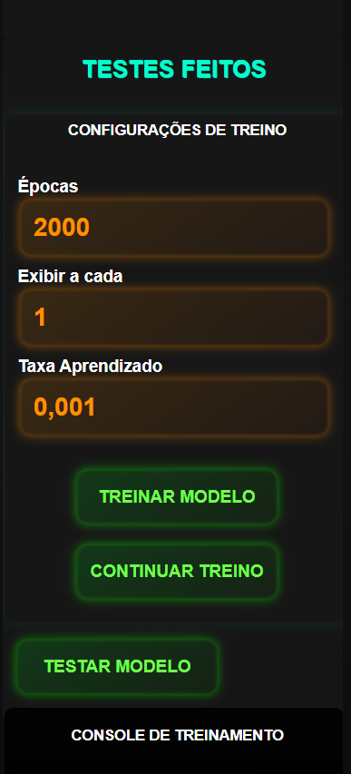

# classificadordechiffres
Le projet est un logiciel de reconnaissance de lettres et de chiffres réalisé avec un réseau neuronal en JavaScript. Avec lui, vous pouvez dessiner des lettres et des chiffres, en créant un ensemble de données personnalisé pour entraîner le modèle. Il est possible de sauvegarder ces données sur votre ordinateur au format JSON et d'importer des données pour continuer à ajouter de nouveaux dessins et poursuivre l'entraînement. Après l'entraînement, vous pouvez tester le modèle en dessinant de nouvelles images et voir comment il identifie ce que vous avez dessiné.

# 🌐 Langues
[Lire en Anglais](./README-en.md)

# Images d'exemple
## Ordinateur

## Tablette

## Téléphone

# Détails
Ce projet a été créé pour poursuivre deux autres de mes projets :

- [WilliamJardim/MLP-Mini](https://github.com/WilliamJardim/MLP-mini)  
  L'implémentation du réseau neuronal MLP.

- [WilliamJardim/DesenhadorDigitos](https://github.com/WilliamJardim/desenhadordigitos)  
  L'éditeur d'images intégré.