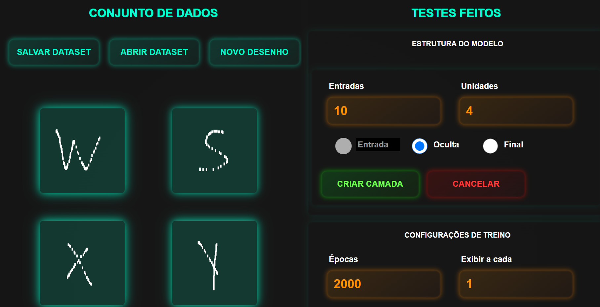
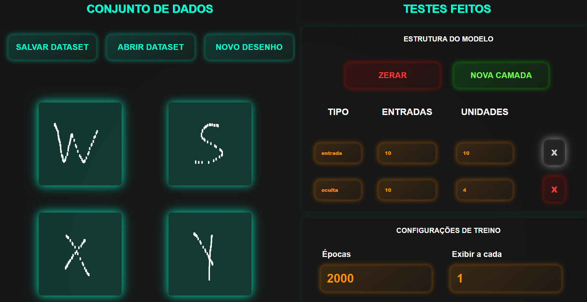

# classificadordigitos
O projeto é um software para reconhecimento de letras e números feito com uma rede neural em JavaScript. Com ele, você pode desenhar letras e números, criando um conjunto de dados personalizado para treinar o modelo. É possível salvar esses dados no computador em formato JSON e também importar dados para continuar adicionando novos desenhos e continuar treinando. Após o treinamento, você pode testar o modelo desenhando novas imagens e ver como ele identifica o que você desenhou.

# Testes que fiz
Testei com alguns datasets que inventei. Cada dataset tem 3 imagens diferentes. Para criar esses datasets usei desenhos dos números 1,2,3, e também, em outro dataset, desenhos de 3 letras como W,J e B. Até o momento testei com 4 datasets diferentes que inventei, mais que seguem esse padrão de ter 3 imagens.
Você pode ler sobre esses testes acessando as pastas:
 - [Testes com desenhos de letras](./testes%20com%20letras/) 
 - [Testes com desenhos de numeros](./testes%20com%20numeros/) 

# 🌐 Languages
 - [Read in English](./README-en.md)
 - [Leer en Español](./README-es.md)
 - [Leggi in Italiano](./README-it.md)
 - [Lire en Français](./README-fr.md)
 - [日本語で読む](./README-ja.md)
 - [Auf Deutsch lesen](./README-de.md)

# Detalhes
Este projeto foi construído para dar continuidade a dois outros projetos meus:

 - [WilliamJardim/MLP-Mini](https://github.com/WilliamJardim/MLP-mini) 
 A implantação da Rede Neural MLP.

 - [WilliamJardim/DesenhadorDigitos](https://github.com/WilliamJardim/desenhadordigitos)
 O editor de imagens integrado.

# Imagens de exemplo
# Desktop

# Tablet

# Phone

